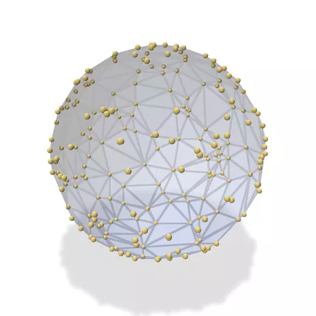

# ffHull-warp

GPU-resident 3D convex hull in **pure [NVIDIA Warp](https://github.com/NVIDIA/warp)**,
implementing the **Flip-Flop / ffHull** algorithm of Gao, Cao, Tan & Huang
(*"Flip-Flop: Convex Hull Construction via Star-Shaped Polyhedron in 3D"*,
[paper](https://www.comp.nus.edu.sg/~tants/flipflop_files/flipflop.pdf)).

Everything but the initial tetrahedron and lower-dimensional fallbacks runs on
the GPU as Warp kernels. The only geometric predicate is `orient3d`.

<p align="center">
  
</p>

<sub>Points drift on a sphere and bob slightly in and out, so they move on and off
the hull; the convex hull is recomputed on the GPU every frame (gold = current
hull vertices, slate = currently interior). Headless polyscope; regenerate with
`python3 scripts/make_anim.py`. Also available as a
<a href="media/sphere_hull.gif">GIF</a>.</sub>

## Algorithm

Two fully data-parallel phases:

1. **Grow a star-shaped polyhedron** (`ffhull/grow.py`). Start from a seed
   tetrahedron with kernel point `s` = centroid. Each point is associated to the
   face whose cone (from `s`) contains it. Each round: pick the furthest point
   per active face, split that face into three (`vab, vbc, vca`), repair
   adjacency, and re-home points onto the three children (dropping points that
   fell beneath the surface). Repeat until no points remain.

2. **Flip-Flop convexification** (`ffhull/flip.py`). Repeatedly flip edges until
   no reflex edge remains — the convex hull. Uses both flip families and both
   criteria from Algorithm 1 of the paper:
   - **V-criterion**: flip reflex flippable 2→2 / 3→1 edges (increase volume).
   - **D-criterion**: label non-extreme vertices (via unflippable reflex 2→2
     edges), reduce their degree with 2→2 "flops", and remove them with a 3→1
     flip, prioritising the smallest-index non-extreme vertex locally.
   Parallel flips are made conflict-free with an `atomic_min` claim over each
   flip's triangle footprint; a flip applies only if its proposer still owns the
   whole footprint (guaranteeing progress + no races).

### Design notes
- Fixed-capacity SoA topology (`ffhull/mesh.py`), ≤ `2n-4` triangles; the two
  new triangles per split are allocated with one atomic counter.
- Reciprocal adjacency slots stored explicitly → constant-time split/flip
  updates. Adjacency repair is a **pure gather** (each triangle rewrites only its
  own links) so there are no cross-triangle write races.
- Faces oriented so `orient3d(face, s) < 0`; then "p outside face" ⇔
  `orient3d(face, p) > 0`, and an edge is reflex ⇔ the neighbour apex is outside.

### GPU-resident & graph-capturable
- Seed selection (extreme points + affine-dimension test, `ffhull/seed.py`) runs
  as Warp reductions on the device — no O(n) host passes.
- Both phases carry all counts in device arrays and launch over a fixed capacity,
  so each loop body is **captured once as a conditional CUDA graph**
  (`wp.capture_while`) and replayed to convergence with **zero per-round host
  synchronisation**. A device-side iteration cap guarantees termination.
- `use_graph=False` gives an equivalent debug path.

### Robustness
- The float64 predicate is exact for full-dimensional inputs to aspect ratios
  ~1e6. `convex_hull(robust=True)` (default) validates each result on-GPU (O(F)
  reflex test + size-gated O(nF) containment) and, if a degenerate input yields
  an invalid hull, **deterministically joggles and retries**.
- `predicates.o3d_sign` provides a certified-filter + Simulation-of-Simplicity
  sign (unit-tested) as a robust primitive; wiring it through the topology
  kernels is future work (see `warp_orient3d_plan.md`).

## Status
- [x] Phase A: parallel star-shaped growth
- [x] Phase B: Flip-Flop convexification (2→2 + 3→1, V & D criteria)
- [x] GPU-resident seed; sync-free, CUDA-graph-captured loops
- [x] Lower-dimensional inputs (coincident / collinear / coplanar) + duplicates
- [x] Robust on coplanar-facet / grid / near-degenerate input (joggle-retry)
- [ ] Simulation of Simplicity wired through the topology kernels (predicate is
  ready; needs consistent use in growth's furthest-point step)

**Correctness:** 29-test suite passes; `stress.py` reports 16/16 valid on an
adversarial battery (general-position exact vs `scipy.spatial.ConvexHull`,
degenerate inputs verified as valid enclosing hulls).

**Performance (NVIDIA L40, end-to-end incl. host↔device):**

| input | n | ffHull | qhull | speedup |
|-------|---|--------|-------|---------|
| sphere (all extreme) | 1M | 0.80 s | 6.0 s | **7.5×** |
| sphere | 5M | 5.1 s | 36 s | **7.1×** |
| gaussian (tiny hull) | 1M | 37 ms | 148 ms | 4.0× |
| gaussian | 5M | 0.39 s | 0.85 s | 2.2× |

**Real-world scans** — [`alecjacobson/threedscans`](https://huggingface.co/datasets/alecjacobson/threedscans)
(Oliver Laric's high-res museum scans; raw STL vertices, 1.8–6.4 M points each):
ffHull is **8–16× faster than qhull per scan** (13.9× overall across the 9
scans, 0.58 s vs 8.0 s; Hermanubis 6.4 M pts in 96 ms). Every hull is valid — no
extreme vertices missed; on
scans with flat sampled facets a few extra coplanar-boundary vertices appear
(qhull merges those into non-simplicial facets; ffHull returns a simplicial
hull). Run `python3 bench_scans.py` (needs `huggingface_hub`, `trimesh`).

The float64 predicate path is intentional: on Ada GPUs fp64 is 1/64 rate and an
fp32-first filter is ~6× faster *per predicate*, but the near-degenerate
predicates that pervade coplanar facets and dense hulls make it oscillate and
fall back, a net loss here — see `docs/` notes. The realized wins came from
avoiding host↔device overhead: GPU-resident seed, no per-round syncs (CUDA
graphs), `wp.empty` allocation, launching flips over the live triangle count,
and reusing the workspace across calls. See `docs/optimization_notes.md`.

## Install

Requires a CUDA-capable GPU and `warp-lang>=1.15` (pulled in automatically).

Install the latest from GitHub:
```bash
pip install git+https://github.com/alecjacobson/warp-ffHull.git
```

Or clone and install (add `-e` for an editable/development install, and
`[test]` to pull in scipy + pytest for the test suite):
```bash
git clone https://github.com/alecjacobson/warp-ffHull.git
cd warp-ffHull
pip install .            # or: pip install -e '.[test]'
```

## Usage
```python
import numpy as np
from ffhull.hull import convex_hull

pts = np.random.standard_normal((100_000, 3))
faces = convex_hull(pts, device="cuda:0")          # (m, 3) outward triangles
faces, verts = convex_hull(pts, return_vertices=True)
# convex_hull(pts, use_graph=False, robust=False) to disable graph capture / retry
# convex_hull(pts, filter=True)  # opt-in conservative interior-point cull;
#   discards points inside a coarse inner hull first. A win for large SOLID /
#   volumetric clouds (most points are deep interior); a no-op for surface scans.
```

## Test & benchmark
```
pytest tests/            # 27 tests
python3 stress.py        # robustness battery + perf sweep
python3 bench.py
```
