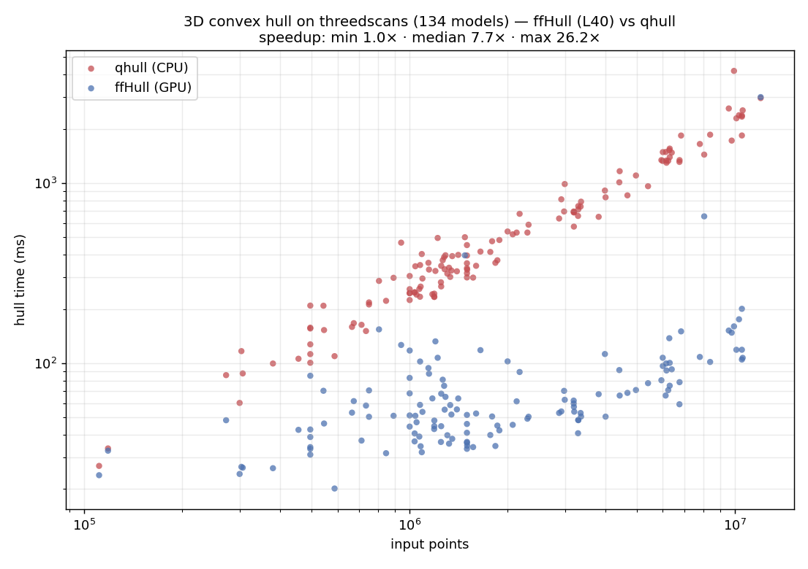
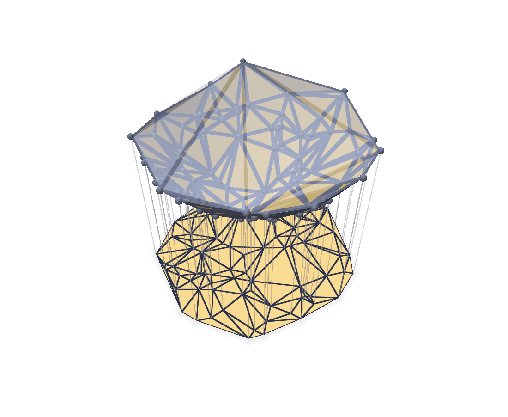

# ffHull-warp

GPU-resident 3D convex hull in **pure [NVIDIA Warp](https://github.com/NVIDIA/warp)**,
implementing the **Flip-Flop / ffHull** algorithm of Gao, Cao, Tan & Huang
(*"Flip-Flop: Convex Hull Construction via Star-Shaped Polyhedron in 3D"*,
[paper](https://www.comp.nus.edu.sg/~tants/flipflop_files/flipflop.pdf)).

Everything but the lower-dimensional fallbacks runs on the GPU as Warp kernels —
including seed selection and the initial tetrahedron, so a full-dimensional hull
touches the host only for the final face read-back. The only geometric predicate
is `orient3d`.

<p align="center">
  
</p>

<sub>Points drift on a sphere and bob slightly in and out, so they move on and off
the hull; the convex hull is recomputed on the GPU every frame (gold = current
hull vertices, slate = currently interior). Headless polyscope; regenerate with
`python3 scripts/make_anim.py`. Also available as a
<a href="media/sphere_hull.gif">GIF</a>.</sub>

## Algorithm

Two fully data-parallel phases:

1. **Grow a star-shaped polyhedron** (`ffhull/grow.py`). Start from a seed
   tetrahedron with kernel point `s` = centroid. Each point is associated to the
   face whose cone (from `s`) contains it. Each round: pick the furthest point
   per active face, split that face into three (`vab, vbc, vca`), repair
   adjacency, and re-home points onto the three children (dropping points that
   fell beneath the surface). Repeat until no points remain.

2. **Flip-Flop convexification** (`ffhull/flip.py`). Repeatedly flip edges until
   no reflex edge remains — the convex hull. Uses both flip families and both
   criteria from Algorithm 1 of the paper:
   - **V-criterion**: flip reflex flippable 2→2 / 3→1 edges (increase volume).
   - **D-criterion**: label non-extreme vertices (via unflippable reflex 2→2
     edges), reduce their degree with 2→2 "flops", and remove them with a 3→1
     flip, prioritising the smallest-index non-extreme vertex locally.
   Parallel flips are made conflict-free with an `atomic_min` claim over each
   flip's triangle footprint; a flip applies only if its proposer still owns the
   whole footprint (guaranteeing progress + no races).

### Design notes
- Fixed-capacity SoA topology (`ffhull/mesh.py`), ≤ `2n-4` triangles; the two
  new triangles per split are allocated with one atomic counter.
- Reciprocal adjacency slots stored explicitly → constant-time split/flip
  updates. Adjacency repair is a **pure gather** (each triangle rewrites only its
  own links) so there are no cross-triangle write races.
- Faces oriented so `orient3d(face, s) < 0`; then "p outside face" ⇔
  `orient3d(face, p) > 0`, and an edge is reflex ⇔ the neighbour apex is outside.

### GPU-resident & graph-capturable
- Seed selection (extreme points, tetra-vertex choice, affine-dimension test,
  `ffhull/seed.py`) runs as Warp reductions on the device — no O(n) host passes.
  Only two O(1) scalars (dimension + coordinate scale) are read back; no point
  coordinates reach the host on the full-dimensional path.
- The **initial tetrahedron is built on the GPU** (`init_tetra_gpu`): one kernel
  orients the 4 seed faces, wires their reciprocal adjacency, and writes the
  kernel point `s` — no host-side geometry or per-face upload. Seed membership in
  growth is likewise a device test, so nothing about setup is O(n) on the host.
- Both phases carry all counts in device arrays and launch over a fixed capacity,
  so each loop body is **captured once as a conditional CUDA graph**
  (`wp.capture_while`) and replayed to convergence with **zero per-round host
  synchronisation**. A device-side iteration cap guarantees termination.
- `use_graph=False` gives an equivalent debug path.

### Robustness
- The float64 predicate is exact for full-dimensional inputs to aspect ratios
  ~1e6. `convex_hull(robust=True)` (default) validates each result on-GPU (O(F)
  reflex test + size-gated O(nF) containment) and, if a degenerate input yields
  an invalid hull, **deterministically joggles and retries**.
- `predicates.o3d_sign` provides a certified-filter + Simulation-of-Simplicity
  sign (unit-tested) as a robust primitive; wiring it through the topology
  kernels is future work (see `warp_orient3d_plan.md`).

## Status
- [x] Phase A: parallel star-shaped growth
- [x] Phase B: Flip-Flop convexification (2→2 + 3→1, V & D criteria)
- [x] GPU-resident seed; sync-free, CUDA-graph-captured loops
- [x] Lower-dimensional inputs (coincident / collinear / coplanar) + duplicates
- [x] Robust on coplanar-facet / grid / near-degenerate input (joggle-retry)
- [ ] Simulation of Simplicity wired through the topology kernels (predicate is
  ready; needs consistent use in growth's furthest-point step)

**Correctness:** 33-test suite passes; `stress.py` reports 16/16 valid on an
adversarial battery (general-position exact vs `scipy.spatial.ConvexHull`,
degenerate inputs verified as valid enclosing hulls).

**Performance (NVIDIA L40, end-to-end incl. host↔device):**

| input | n | ffHull | qhull | speedup |
|-------|---|--------|-------|---------|
| sphere (all extreme) | 1M | 0.81 s | 6.0 s | **7.4×** |
| sphere | 5M | 4.7 s | 35 s | **7.5×** |
| gaussian (tiny hull) | 1M | 21 ms | 151 ms | 7.3× |
| gaussian | 5M | 42 ms | 0.87 s | **21×** |

**Real-world scans** — [`alecjacobson/threedscans`](https://huggingface.co/datasets/alecjacobson/threedscans)
(Oliver Laric's high-resolution museum scans: **134 models**, 0.1–12 M points
each, raw mesh vertices). Across all 134, ffHull is **1.0× / 7.7× / 26.2×**
(min / median / max) faster than qhull, and never slower — the GPU advantage
grows with input size (qhull scales ~linearly with points; ffHull's time is
dominated by the small hull). The **1.0×** floor is just the smallest clouds
(~0.1 M points, e.g. *Actaeon* at 1.03×), where ffHull's ~25 ms of fixed GPU
overhead (upload + kernel launches + graph capture) roughly equals qhull's
already-tiny time; for **n ≥ 1 M the median speedup is ~10×**, topping out at
26× on the ~10 M-point models. Every hull is valid — no extreme vertices missed;
on scans with flat sampled facets a few extra coplanar-boundary vertices appear
(qhull merges those into non-simplicial facets, ffHull returns a simplicial hull).

<p align="center"></p>

Regenerate with `python3 plot_scans.py` (resumable; caches to
`media/scans_results.csv`) — needs `huggingface_hub`, `trimesh`, `matplotlib`.

The float64 predicate path is intentional: on Ada GPUs fp64 is 1/64 rate and an
fp32-first filter is ~6× faster *per predicate*, but the near-degenerate
predicates that pervade coplanar facets and dense hulls make it oscillate and
fall back, a net loss here — see `docs/optimization_notes.md`. The realized wins
came from avoiding host↔device overhead: GPU-resident seed, no per-round syncs
(CUDA graphs), `wp.empty` allocation, launching flips over the live triangle
count, reusing the workspace across calls, and copying back only the live
triangles (not the full `2n` array).

## Install

Requires a CUDA-capable GPU (CUDA 12.4+ for the conditional-graph path) and
Python ≥ 3.8. The only runtime dependencies are `warp-lang>=1.15` and `numpy`,
pulled in automatically.

Install the latest from GitHub:
```bash
pip install git+https://github.com/alecjacobson/warp-ffHull.git
```

Or clone and install (add `-e` for an editable/development install):
```bash
git clone https://github.com/alecjacobson/warp-ffHull.git
cd warp-ffHull
pip install .                 # runtime only
pip install -e '.[test]'      # + scipy, pytest        (test suite / stress.py)
pip install -e '.[viz]'       # + polyscope, imageio   (scripts/make_anim.py)
```
The `bench_scans.py` / `plot_scans.py` scan benchmarks additionally need
`huggingface_hub`, `trimesh`, and `matplotlib`.

## Usage
```python
import numpy as np
from ffhull.hull import convex_hull

pts = np.random.standard_normal((100_000, 3))
faces = convex_hull(pts, device="cuda:0")               # (m, 3) triangle indices
faces, verts = convex_hull(pts, return_vertices=True)   # + extreme-vertex indices
```
`faces` indexes into `pts`; each triangle is wound so `orient3d(face, s) < 0`
(inward). Options:
- `robust=True` (default) — validate on-GPU and joggle-retry degenerate input.
- `reuse=True` (default) — reuse a pooled workspace across calls; `clear_pool()`
  frees it.
- `use_graph=True` (default) — CUDA-graph the loops; `False` is an equivalent
  debug path.
- `filter=True` (opt-in) — conservative interior-point cull; a win for large
  **solid/volumetric** clouds (most points deep interior), a no-op for surface
  scans (points sit on the hull boundary).

Coincident / collinear / coplanar (lower-dimensional) inputs are detected and
dispatched to a host handler; duplicates are fine.

## 2D Delaunay triangulation (via lifting)

The Delaunay triangulation of 2D points is the projection of the **lower faces**
of the 3D convex hull of the points lifted onto the paraboloid `z = x² + y²`.
`ffhull.delaunay.delaunay_2d` is a thin, pure-Warp wrapper around `convex_hull`
that does exactly that — lift, hull on the GPU, keep the downward-facing faces:

```python
import numpy as np
from ffhull.delaunay import delaunay_2d

pts = np.random.default_rng(0).standard_normal((100_000, 2))
tris = delaunay_2d(pts, device="cuda:0")     # (m, 3) CCW triangle indices into pts

# also expose the underlying 3D lift for visualisation / debugging:
tris, lift, faces, is_lower = delaunay_2d(pts, return_lifted=True)
```

It matches `scipy.spatial.Delaunay` in general position and satisfies the
empty-circumcircle property (see `tests/test_delaunay.py`). The figure below
(from `python3 scripts/make_delaunay_demo.py`) shows the whole construction: the
lifted paraboloid hull with its **lower envelope in gold** (the Delaunay faces)
and the remaining upper faces translucent slate, the extracted flat 2D Delaunay
triangulation below it, and drop-lines from each lifted vertex to its projection.

<p align="center"></p>

## Test & benchmark
```
pytest tests/            # 33 tests (accuracy, robustness, degenerate, delaunay, perf)
python3 stress.py        # 16-case robustness battery + GPU-vs-qhull sweep
python3 bench.py         # synthetic sphere / gaussian sweep
python3 plot_scans.py    # threedscans figure (media/scans_benchmark.png)

python3 scripts/make_delaunay_demo.py   # Delaunay lifting figure (needs polyscope)
```
